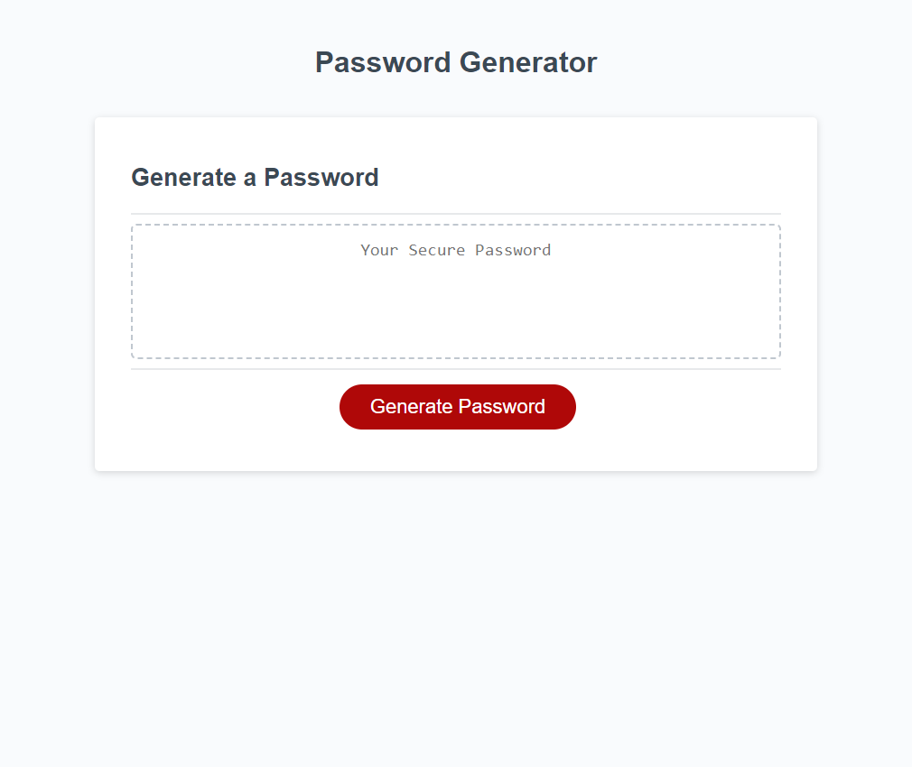

# Random Password Generator

## introduction
In this bootcamp assignment, we were tasked with making a random number generator. We had starter code supplied to us which included the complete html file, array in the js file and empty functions for us to complete ourselves.I used skills that i had learnt in the previous weeks, such as FOR loops, IF statements, functions ,objects and array functions.

## Image of web page

## Link to live site
https://gpsnm.github.io/RandomPasswordGen/
